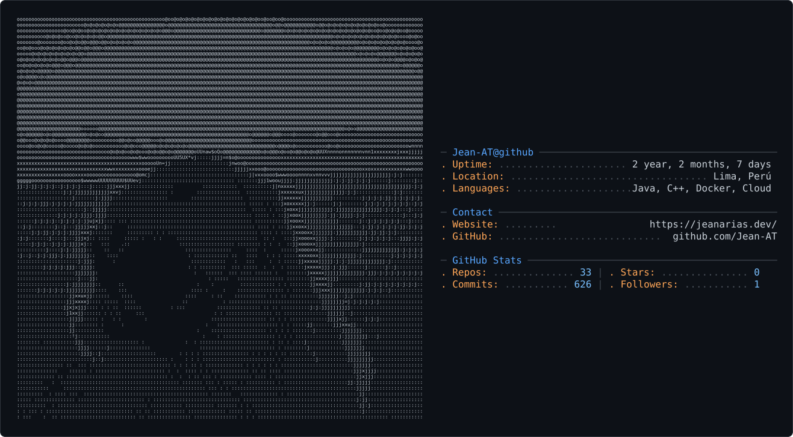

<picture>
  
</picture>

# Hi, I'm Jean Arias  

I'm a **Software Engineering student** at the **Peruvian University of Applied Sciences (UPC)**.  
I have growing experience in **backend development**, where I enjoy building APIs and structured systems using modern technologies.  

## About Me  
- Currently learning **Java (Spring Boot)** and **Node.js** for backend development.  
- Passionate about creating practical software that solves real problems.  
- I believe in continuous learning and self-improvement through hands-on projects.  

## Languages  

## Skills  
-  **Autonomous learning** — I love exploring new technologies by myself.  
-  **Basic English** — enough to read documentation and collaborate in global projects.  
-  **Problem solving** — I focus on writing clean and efficient code.  
-  **Team collaboration** — always open to sharing ideas and feedback.  

---
